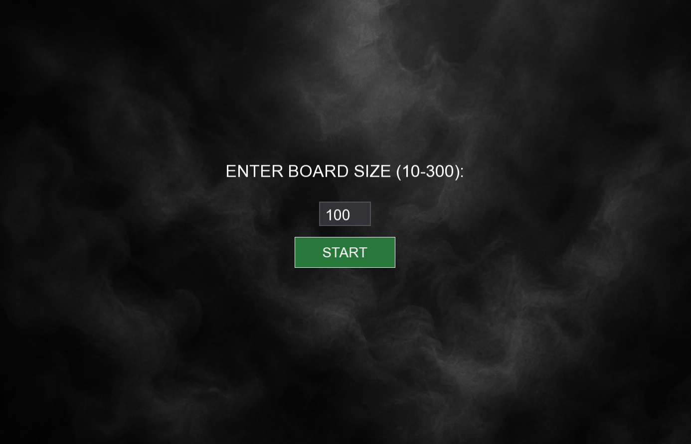
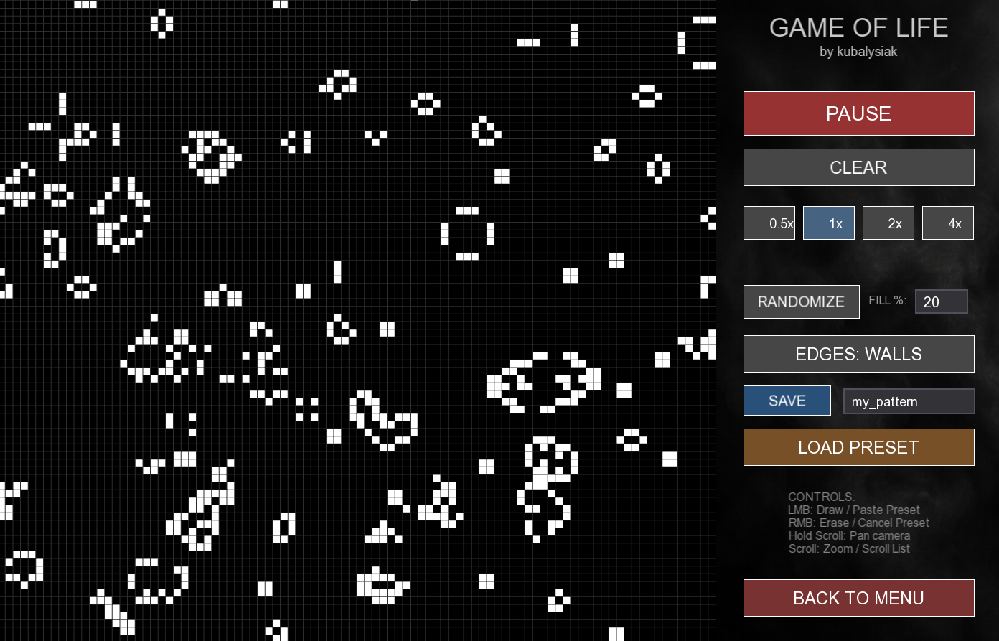
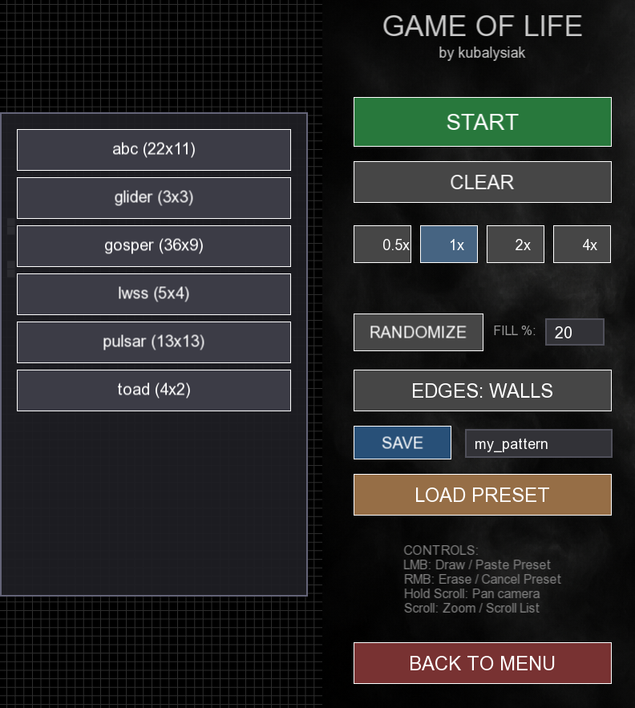
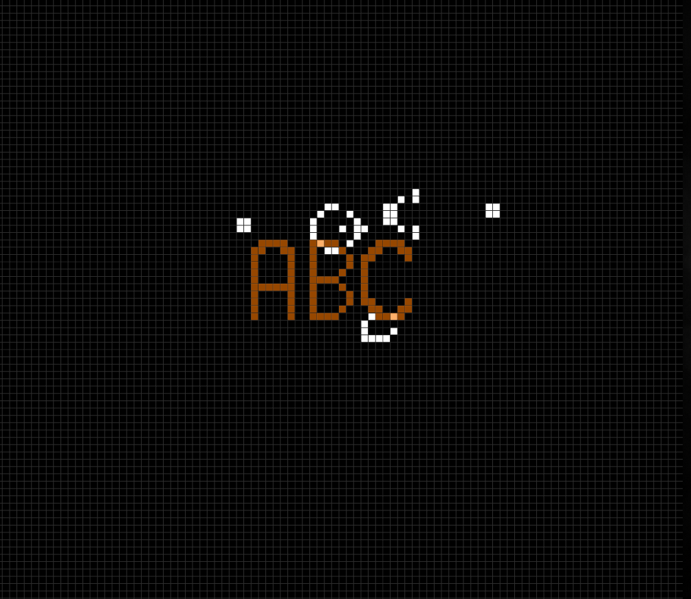

# Conway's Game of Life (C++ / SFML)

An interactive implementation of Conway's Game of Life written in C++ using the SFML graphics library. Project features a custom user interface,
preset management and a rendering pipeline.

## Controls

* **Left Mouse Button:** Draw active cells / Paste selected preset.
* **Right Mouse Button:** Erase cells / Cancel preset placement.
* **Middle Mouse Button (Hold & Drag):** Pan the camera around the board.
* **Scroll Wheel:** Zoom in and out of the grid / Scroll through preset list.

## Features

* **High-performance rendering:** The board is represented as contiguous 1D RGBA pixel buffer (`std::vector<sf::Uint8>`). Cell states are written directly to this buffer,
which is then uploaded to `sf::Texture` for rendering.
* **Dynamic Simulation Control:**
	*	Adjust simulation speed in real-time.
	*	Toggle edge behavior: **Walls** (hard-borders) or **Wrap**.
	*	Randomize the board with a customizable fill percentage.
* **Camera Controls:** Smooth panning and zooming support for large grids.
* **Preset Management:** Save cellular automata patterns to local `.txt` files and load them on the fly.
* **Ghost Placement:** When a preset is selected, a translucent preview follows your cursor, allowing for precise pattern placement.

## Building and running
This project supports multiple builds methods. Choose the one that fits your environment.

### Prerequisities
*	C++20 compatible compiler.
*	[SFML Library](https://www.sfml-dev.org/download/) (Version 2.5.x).
*	[CMake](https://cmake.org/) (Version 3.15 or newer) - *if using CMake build methods*.

---

### Option 1: Visual Studio Project
1. **Clone the repository:**
	```bash
	git clone https://github.com/kubalysiak/game-of-life-simulation-sfml.git
	```
2. **Configure SFML in Visual Studio:**
   *	Open project **Properties**
   *	Under **C/C++ -> General -> Additional Include Directories**, add the path to `SFML/include`.
   *    Under **Linker -> General -> Additional Library Directories**, add the path to `SFML/lib`.
   *	Under **Linker -> Input -> Additional Dependencies**, add:
		*   `sfml-graphics.lib`
        *   `sfml-window.lib`
        *   `sfml-system.lib`

        *(Note: If building in Debug mode, append `-d` to these filenames, e.g., `sfml-graphics-d.lib`)*.
3. **Assets & DLLs:**
   *   Ensure that the `assets` folder (containing fonts and UI graphics) is located in the same directory as your executable.
   *   Copy all required SFML `.dll` files from `SFML/bin` to your executable directory.
4. **Build**
   *	Build and run.

### Option 2: Visual Studio via CMake
1. **Clone the repository:**
	```bash
	git clone https://github.com/kubalysiak/game-of-life-simulation-sfml.git
	```
2. **Open Project:**
   *	Open Visual Studio and select Open a local folder (select the root folder containing `CMakeLists.txt`).
3. **Configure SFML path:**
   *	Go to **Project -> CMake Settings**.
   *	Add a new CMake variable named `SFML_DIR` and set its value to your SFML cmake directory (e.g. `C:/SFML-2.5.x/lib/cmake/SFML`).
   *	Save `CMakeSettings.json`.
4. **Assets & DLLs:**
   *	Build the project.
   *	Copy all required `.dll` files from your SFML `bin/` folder into the build output directory.
   *	Copy the `assets/` folder into the same build output directory.
5. **Run the .exe file**
### Option 3: Linux (CMake / Command Line)
1. **Clone the repository:**
	```bash
	git clone https://github.com/kubalysiak/game-of-life-simulation-sfml.git
	cd game-of-life-simulation-sfml
	```
2. **Install dependencies:**
   ```bash
   sudo apt install libsfml-dev cmake g++
   ```
3. **Build the project:**
   ```bash
   mkdir build && cd build
   cmake ..
   make
   ```
4. **Run:**
   *	Copy `assets/` and `presets/` folders into your `build/` directory (or ensure the executable path is set correctly).
   ```bash
   ./GameOfLifekubalysiak
   ```

## Screenshots


*Main menu with grid size selection.*


*Simulation view with active UI panel.*



*Preset management system allowing users to save, load and place patterns using visual ghost preview.*

## License
This project is open-sourced and available under the MIT License.